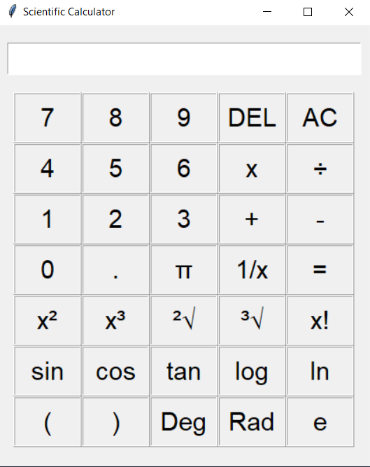

# Scientific_Calculator
A scientific calculator built using <b>tkinter</b> libary of <b>python</b>.

	

# How to run on your local system
<b>Fork</b> the repo, then <b>clone</b> it on your local machine

Open <b>powershell window</b> and run the command <b>python main.py</b>

	

